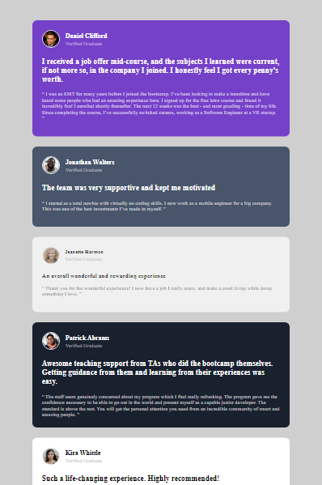

# Frontend Mentor - Testimonials grid section solution

This is a solution to the [Testimonials grid section challenge on Frontend Mentor](https://www.frontendmentor.io/challenges/testimonials-grid-section-Nnw6J7Un7). Frontend Mentor challenges help you improve your coding skills by building realistic projects. 

## Table of contents
  - [Screenshot](#screenshot)
  - [Links](#links)
- [My process](#my-process)
  - [Built with](#built-with)
  - [What I learned](#what-i-learned)
  - [Continued development](#continued-development)
- [Author](#author)

### Screenshot

### Links

- Solution URL: [solution URL here]()
- Live Site URL: [Add live site URL here](https://your-live-site-url.com)

## My process
  Used main container as flex and use grid for other.

### Built with

- Semantic HTML5 markup
- CSS custom properties
- Flexbox
- CSS Grid

### What I learned
  learned the great way to use grid.

### Continued development
learn more about grid properties.

## Author

- Frontend Mentor - [@Rustom0](https://www.frontendmentor.io/profile/Rustom0)

